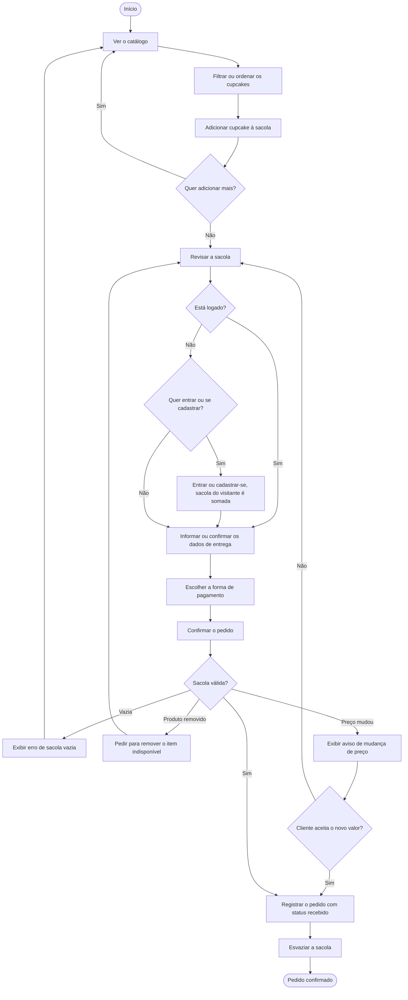
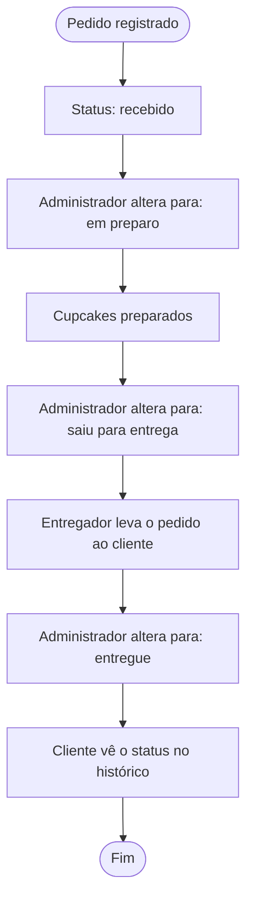
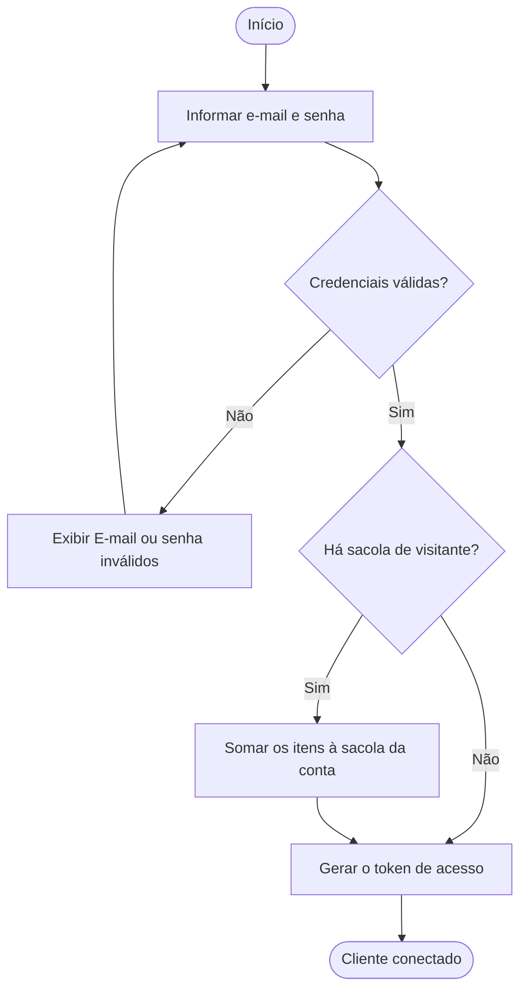

# Diagramas de atividades

## Fluxo de compra (do catálogo ao pedido)

```mermaid
flowchart TD
    inicio([Início]) --> catalogo[Ver o catálogo]
    catalogo --> filtro[Filtrar ou ordenar os cupcakes]
    filtro --> adicionar[Adicionar cupcake à sacola]
    adicionar --> mais{Quer adicionar mais?}
    mais -- Sim --> catalogo
    mais -- Não --> sacola[Revisar a sacola]
    sacola --> logado{Está logado?}
    logado -- Sim --> dados[Informar ou confirmar os dados de entrega]
    logado -- Não --> conta{Quer entrar ou se cadastrar?}
    conta -- Sim --> login[Entrar ou cadastrar-se, sacola do visitante é somada]
    login --> dados
    conta -- Não --> dados
    dados --> pagamento[Escolher a forma de pagamento]
    pagamento --> confirmar[Confirmar o pedido]
    confirmar --> valida{Sacola válida?}
    valida -- Vazia --> erro1[Exibir erro de sacola vazia]
    valida -- Produto removido --> erro2[Pedir para remover o item indisponível]
    valida -- Preço mudou --> aviso[Exibir aviso de mudança de preço]
    aviso --> aceita{Cliente aceita o novo valor?}
    aceita -- Sim --> registrar
    aceita -- Não --> sacola
    erro1 --> catalogo
    erro2 --> sacola
    valida -- Sim --> registrar[Registrar o pedido com status recebido]
    registrar --> esvaziar[Esvaziar a sacola]
    esvaziar --> fim([Pedido confirmado])
```

## Fluxo do pedido: do preparo à entrega

```mermaid
flowchart TD
    inicio([Pedido registrado]) --> recebido[Status: recebido]
    recebido --> preparo[Administrador altera para: em preparo]
    preparo --> pronto[Cupcakes preparados]
    pronto --> saida[Administrador altera para: saiu para entrega]
    saida --> entrega[Entregador leva o pedido ao cliente]
    entrega --> entregue[Administrador altera para: entregue]
    entregue --> cliente[Cliente vê o status no histórico]
    cliente --> fim([Fim])
```

## Fluxo de login com mesclagem da sacola

```mermaid
flowchart TD
    inicio([Início]) --> dados[Informar e-mail e senha]
    dados --> valida{Credenciais válidas?}
    valida -- Não --> erro[Exibir E-mail ou senha inválidos]
    erro --> dados
    valida -- Sim --> guest{Há sacola de visitante?}
    guest -- Sim --> merge[Somar os itens à sacola da conta]
    guest -- Não --> token
    merge --> token[Gerar o token de acesso]
    token --> fim([Cliente conectado])
```
